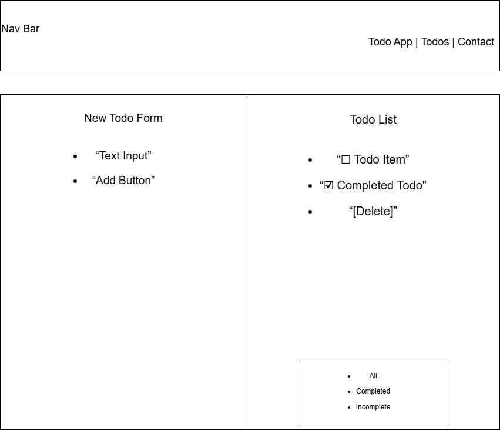
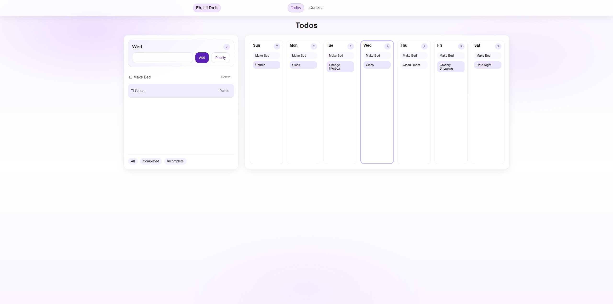
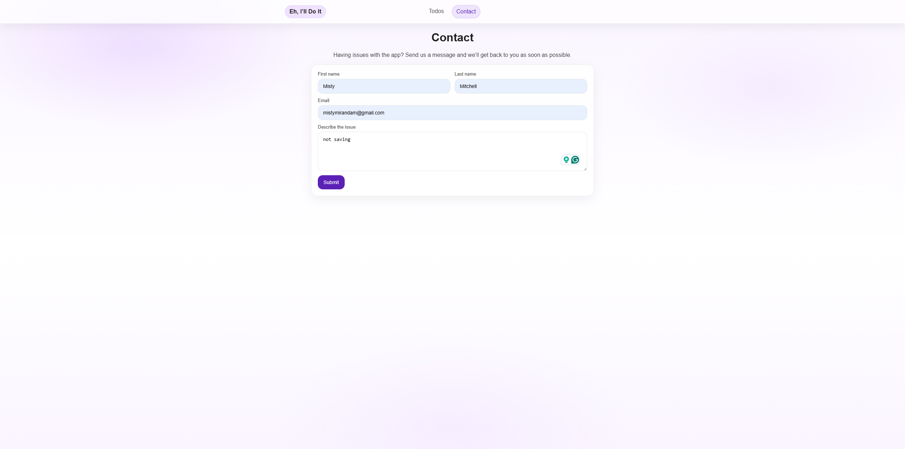

# Eh, I’ll Do It

Eh, I’ll Do It is a React-based weekly todo application designed to help users organize tasks by day.  
The application focuses on simplicity while still providing useful features such as task completion, priority marking, and weekly planning.

## Purpose

The purpose of this project was to practice building a multi-page React application using components, state management, and routing.  
This project also emphasizes responsive design, user interaction, and deployment using GitHub Pages.

## Live Site

https://mistymirandam.github.io/react-todo-app/

## Features

- Weekly calendar-style todo layout
- Add and delete tasks for specific days
- Mark tasks as completed
- Highlight important tasks using a priority option
- Filter tasks by all, completed, or incomplete
- Persistent data storage using localStorage
- Contact form for user feedback using EmailJS
- Responsive design for desktop and mobile screens

## Wireframes

The wireframes were created to plan the layout and functionality of the application before development.

### Todo Page Wireframe

### Contact Page Wireframe

## Final Screenshots

These screenshots show the completed application after implementation.

### Todo Page

### Contact Page

## Technologies Used

- React
- JavaScript
- CSS
- React Router
- EmailJS
- GitHub Pages
